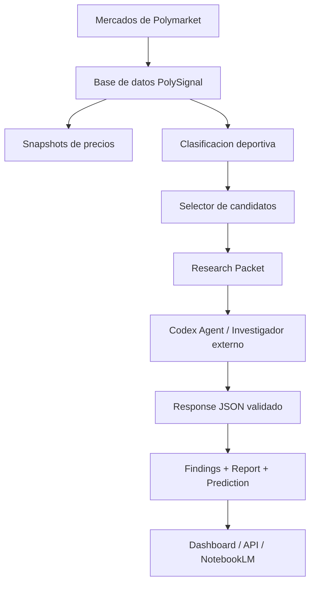
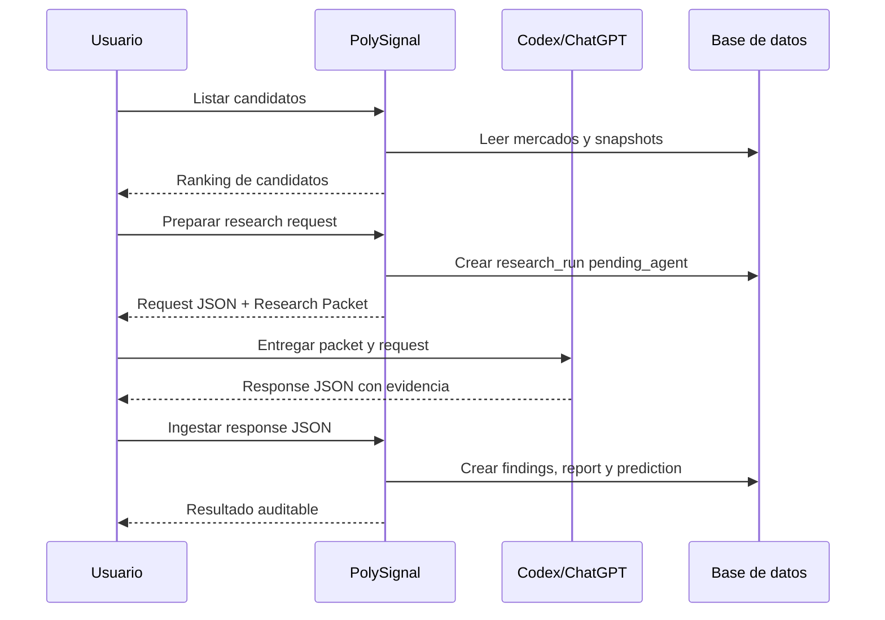
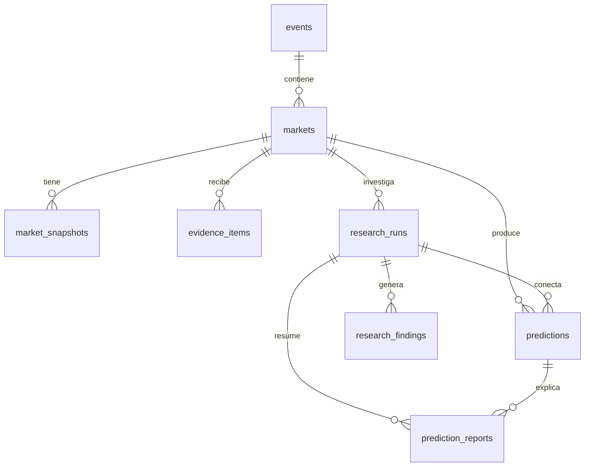
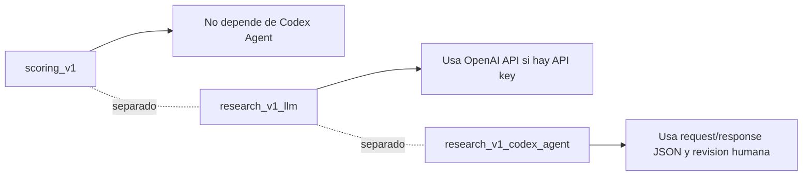
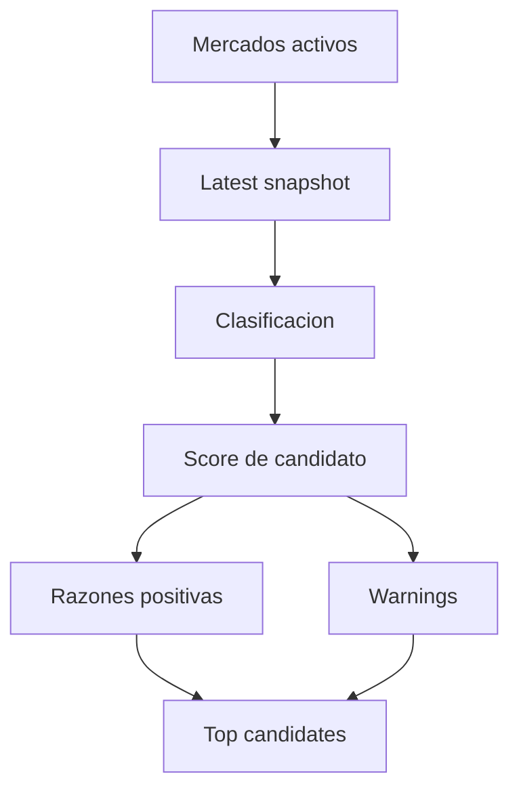
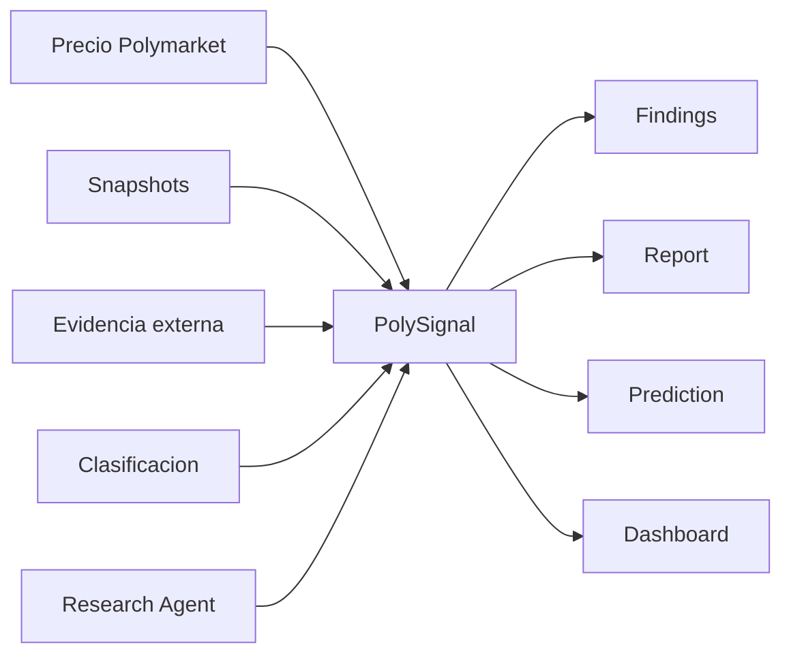

# PolySignal: Sistema de Inteligencia para Mercados Predictivos de Polymarket

Documento preparado para NotebookLM.

Fecha de referencia del repo revisado: 2026-04-25, segun `docs/project-status.md` y el estado local del proyecto. Actualizado despues del cierre del sprint Quality Gate / Validation Layer.

Estado importante del repo al momento de crear este documento:

- Rama actual: `main`.
- Ultimo sprint taggeado: `v0.6.0-codex-research-packets`.
- Ultimo sprint cerrado por commit: Quality Gate / Validation Layer.
- Commit Quality Gate: `4a03d687dd13a7476cb6216a2428e722a10feb3c`.
- Tag del Quality Gate: pendiente de crear si se decide marcar ese checkpoint.
- Este documento describe el sistema estable hasta el commit `4a03d68` y deja claro que el Quality Gate ya esta implementado.

---

## 1. Resumen ejecutivo

PolySignal, tambien llamado internamente Polisygnal en algunos mensajes operativos, es un sistema de inteligencia para mercados predictivos de Polymarket. Su objetivo es ayudar a analizar mercados binarios, especialmente deportivos, combinando precio de mercado, historico local, evidencia externa, clasificacion del tipo de mercado, reportes explicables y predicciones trazables.

En terminos simples: Polymarket muestra lo que el mercado esta pagando hoy. PolySignal intenta responder si ese precio parece razonable cuando se compara con informacion externa y con reglas de analisis propias.

Por ejemplo:

> Si Polymarket dice que un resultado tiene 52% de probabilidad, PolySignal intenta responder: hay evidencia externa que sugiera que la probabilidad razonable puede ser 48%, 55% o 60%?

PolySignal no es una casa de apuestas, no ejecuta apuestas automaticas y no promete resultados. Es una capa de analisis para tomar decisiones mejor informadas.

### Idea central

| Elemento | Que representa | Por que importa |
|---|---|---|
| Precio de Polymarket | Probabilidad implicita creada por compradores y vendedores | Puede ser util, pero tambien puede estar sesgada, incompleta o atrasada |
| Snapshots | Fotos historicas del precio, liquidez y volumen | Permiten ver el estado del mercado en distintos momentos |
| Evidencia externa | Noticias, odds, contexto deportivo o research estructurado | Ayuda a contrastar el precio con informacion fuera de Polymarket |
| Scoring | Calculo propio, conservador y explicable | Convierte datos y evidencia en una lectura operativa |
| Reportes | Resumen narrativo y auditable | Permiten revisar por que el sistema llego a una conclusion |
| Dashboard/API | Forma de consumir el estado actual | Facilita inspeccion visual y tecnica |

---

## 2. El problema que viene a resolver

Polymarket permite operar mercados predictivos. En muchos casos, el precio de un contrato YES puede leerse como una probabilidad implicita. Si un contrato YES cotiza cerca de `0.52`, el mercado esta expresando aproximadamente 52%.

Pero esa lectura no siempre es suficiente.

El precio puede depender de:

- cuanta gente esta mirando el mercado;
- cuanto volumen y liquidez hay;
- si hay noticias recientes que todavia no fueron absorbidas;
- sesgos de los participantes;
- ruido, poca informacion o movimientos temporales;
- mercados poco profundos o mal clasificados.

Un usuario que solo mira el precio puede perder contexto. PolySignal busca crear una capa propia de analisis para preguntar:

- Que dice el precio?
- Que dice la evidencia externa?
- Que tan confiable es esa evidencia?
- Hay evidencia a favor y en contra?
- El mercado esta bien clasificado?
- El resultado parece investigable ahora?
- La respuesta es una senal fuerte, una senal moderada o simplemente un caso para observar?

### Ejemplo simple

| Situacion | Lectura sin PolySignal | Lectura con PolySignal |
|---|---|---|
| Polymarket marca 52% | "El mercado cree 52%" | "El mercado cree 52%, pero la evidencia externa parece debil; mantener en observacion" |
| Polymarket marca 52% y hay noticias recientes fuertes | "El mercado cree 52%" | "El precio podria estar atrasado; revisar si la evidencia justifica ajustar hacia arriba o abajo" |
| Polymarket marca 52% pero no hay fuentes claras | "Parece balanceado" | "No hay evidencia suficiente; bajar confianza" |

---

## 3. Que es PolySignal

PolySignal es un sistema de analisis, investigacion y scoring para mercados de Polymarket.

No es:

- una casa de apuestas;
- un bot de trading;
- un sistema de ejecucion automatica;
- una garantia de resultados;
- una herramienta para operar sin revision humana.

Si es:

- un backend FastAPI para sincronizar, analizar y exponer mercados;
- una base de datos con mercados, eventos, snapshots, evidencia, predicciones y research runs;
- un conjunto de pipelines y comandos CLI para operar research y scoring;
- una capa de clasificacion de mercados deportivos;
- un selector de candidatos para elegir mejor que investigar;
- un adaptador para que Codex/ChatGPT actue como investigador externo mediante archivos JSON;
- una interfaz web inicial en Next.js;
- un dashboard HTML servido por la API cuando existe el artifact generado.

PolySignal combina:

1. Datos de mercado de Polymarket.
2. Snapshots locales de precio, volumen, liquidez y spread.
3. Evidencia externa estructurada.
4. Clasificacion del mercado.
5. Research local, research con OpenAI API opcional y research externo via Codex Agent.
6. Scoring conservador.
7. Findings, reportes y predicciones auditables.

---

## 4. Como funciona en alto nivel

### Diagrama principal



### Version textual simple

1. PolySignal descubre o carga mercados de Polymarket.
2. Guarda esos mercados en PostgreSQL.
3. Captura snapshots de precios y liquidez.
4. Clasifica el mercado: deporte, forma del mercado y template de investigacion.
5. Selecciona buenos candidatos para investigar.
6. Genera un research packet para un agente externo.
7. El agente devuelve un response JSON estructurado.
8. PolySignal ingesta el JSON, crea findings, reportes y predicciones.
9. El usuario revisa resultados en API, dashboard o documentos.

### Flujo operativo para Codex Agent Research



---

## 5. Arquitectura del proyecto

El repositorio es un monorepo.

```text
N:\projects\polimarket
  apps/
    api/      Backend FastAPI, SQLAlchemy, Alembic, comandos CLI y servicios
    web/      Frontend Next.js inicial
  docs/       Documentacion operativa y tecnica
  scripts/    Wrappers PowerShell para pipeline, snapshots, reports y tareas programadas
  logs/       Artifacts operativos locales; ignorados por git
```

### Stack tecnologico resumido

| Capa | Tecnologia | Para que se usa |
|---|---|---|
| Backend | FastAPI | API HTTP, endpoints de mercados, research, status y dashboard |
| Datos | PostgreSQL | Persistencia de eventos, mercados, snapshots, evidencia, research y predicciones |
| ORM | SQLAlchemy 2 | Modelos y relaciones entre tablas |
| Migraciones | Alembic | Evolucion controlada del esquema de base de datos |
| Contratos | Pydantic | Validacion de requests/responses JSON |
| Tests | pytest | Regresion local de servicios, comandos y endpoints |
| Frontend | Next.js, React, TypeScript | Interfaz web inicial |
| Operacion local | PowerShell scripts | Wrappers de pipeline, snapshots, reports, dashboard y tareas programadas |
| Artifacts | JSON, Markdown, HTML | Requests, packets, reports, briefings, diffs y dashboard generado |
| Research externo | Codex Agent por archivos JSON | Flujo seguro de investigacion asistida sin reutilizar tokens internos |

### Backend API

Ruta principal:

```text
apps/api
```

Capas principales:

| Carpeta | Funcion |
|---|---|
| `app/api` | Rutas HTTP de FastAPI |
| `app/commands` | Comandos CLI para operar pipelines, research, scoring y reportes |
| `app/core` | Configuracion |
| `app/db` | Sesion y base SQLAlchemy |
| `app/models` | Modelos de base de datos |
| `app/repositories` | Acceso a datos |
| `app/schemas` | Contratos Pydantic |
| `app/services` | Logica de negocio |
| `app/services/research` | Research pipeline, OpenAI client, Codex Agent, scoring, clasificacion y candidatos |

### Frontend web

Ruta principal:

```text
apps/web
```

El frontend actual es una base Next.js. Segun `apps/web/package.json`, usa:

- Next.js `15.5.15`
- React `19.2.5`
- TypeScript

Comando disponible desde la raiz:

```powershell
npm --workspace apps/web run dev
```

URL local detectada durante inspeccion:

```text
http://127.0.0.1:3000
```

### API visual / panel FastAPI

URLs locales detectadas durante inspeccion:

| Recurso | URL |
|---|---|
| Frontend Next | `http://127.0.0.1:3000` |
| Panel/API visual FastAPI | `http://127.0.0.1:8000/` |
| Swagger/FastAPI docs | `http://127.0.0.1:8000/docs` |
| Health | `http://127.0.0.1:8000/health` |
| Markets overview | `http://127.0.0.1:8000/markets/overview` |

---

## 6. Modelo de datos en palabras simples

PolySignal guarda la informacion en tablas conectadas.



### Tablas principales

| Tabla | Que guarda |
|---|---|
| `events` | Eventos agrupadores de Polymarket |
| `markets` | Preguntas concretas de mercado, slug, estado, sport_type, market_type |
| `market_snapshots` | Precio YES/NO, midpoint, last trade, spread, volumen y liquidez |
| `sources` | Fuentes externas usadas por evidencia |
| `evidence_items` | Evidencia estructurada asociada a mercados |
| `predictions` | Resultado numerico del scoring o research |
| `research_runs` | Corridas de research, modo usado, estado, errores y metadata |
| `research_findings` | Hallazgos individuales con claim, postura, impacto, frescura, credibilidad y cita |
| `prediction_reports` | Narrativa final con tesis, evidencia a favor/en contra, riesgos y recomendacion |
| `market_outcomes` | Resultado resuelto del mercado, cuando existe |

### Ejemplo conceptual de una prediction

| Campo | Significado |
|---|---|
| `yes_probability` | Probabilidad estimada por PolySignal para YES |
| `no_probability` | Complemento de YES |
| `confidence_score` | Calidad/confianza de la evidencia, no probabilidad de ganar |
| `edge_signed` | Diferencia entre probabilidad estimada y precio de mercado |
| `edge_magnitude` | Magnitud absoluta del edge |
| `prediction_family` | Familia que produjo la prediccion: `scoring_v1`, `research_v1_llm`, `research_v1_codex_agent` |
| `components_json` | Trazabilidad de componentes usados |
| `explanation_json` | Explicacion estructurada del resultado |

---

## 7. Formas actuales de analisis

PolySignal tiene varias familias de prediccion o analisis. Es importante que no se mezclen.

| Familia | Uso | Estado |
|---|---|---|
| `scoring_v1` | Scoring local tradicional basado en mercado, odds/evidence y reglas explicables | Estable en el MVP |
| `research_v1_local` | Research local/fallback cuando no hay OpenAI o cuando se opera sin web | Implementado dentro del pipeline de research |
| `research_v1_llm` | Cheap research con OpenAI API opcional y web_search | Implementado, pero requiere `OPENAI_API_KEY` para llamada real |
| `research_v1_codex_agent` | Research externo por archivos JSON usando Codex/ChatGPT como agente humano-asistido | Implementado hasta paquete operativo |

### Separacion clave



Esta separacion evita confundir un score basado en reglas con una investigacion generada por un agente externo.

---

## 8. Research Foundation

Tag estable:

```text
v0.1.0-research-foundation
```

Commit asociado reportado:

```text
d509be58f53ffde5dc68cac838c99e3ee2f997e5
```

Logro principal:

Se agrego una base formal para ejecutar research sobre mercados. Esta fase introdujo los conceptos de:

- `research_runs`
- `research_findings`
- `prediction_reports`
- research local
- creacion de predicciones conectadas a research
- separacion entre scoring anterior y research nuevo

Importancia:

Antes de esta fase, el sistema podia tener scoring y evidencia, pero no tenia una estructura robusta para guardar una investigacion como objeto auditable. Con Research Foundation, cada corrida puede tener estado, findings, reporte y prediccion asociada.

---

## 9. Cheap Research Real MVP

Tag estable:

```text
v0.2.0-cheap-research
```

Commit asociado reportado:

```text
1dcc484fc6b8679382bd06cdaad0e5c591bbb53b
```

Logro principal:

Se conecto el modo `cheap_research` con una integracion preparada para OpenAI API y web_search, manteniendo fallback seguro a `local_only` si no existe `OPENAI_API_KEY` o si OpenAI falla.

Capacidades agregadas:

- configuracion opcional de OpenAI;
- cliente `openai_client.py`;
- timeout y manejo de errores;
- salida estructurada con evidencia a favor/en contra;
- `confidence_score` separado de probabilidad;
- `recommended_probability_adjustment` limitado a `+/- 0.12`;
- creacion de `research_v1_llm`;
- fallback automatico a local si no hay API key.

Nombres de variables relevantes, sin valores ni secretos:

| Variable | Uso |
|---|---|
| `OPENAI_API_KEY` | Llave API para llamada real desde backend Python |
| `OPENAI_RESEARCH_ENABLED` | Activa/desactiva research OpenAI |
| `OPENAI_RESEARCH_MODEL` | Modelo usado |
| `OPENAI_RESEARCH_TIMEOUT_SECONDS` | Timeout |
| `OPENAI_RESEARCH_MAX_SOURCES` | Maximo de fuentes |
| `OPENAI_RESEARCH_ALLOWED_DOMAINS` | Dominios permitidos |
| `OPENAI_RESEARCH_BLOCKED_DOMAINS` | Dominios bloqueados |

Nota:

La llamada real a OpenAI se reporto pendiente hasta configurar `OPENAI_API_KEY`. El sistema no debe imprimir ni commitear secretos.

---

## 10. Codex Agent Research Adapter

Tag estable:

```text
v0.3.0-codex-agent-research
```

Commit asociado reportado:

```text
6ddd10e2d97425df1b99e22ea3fed3239c0e7640
```

Logro principal:

Se creo un flujo experimental seguro para usar Codex/ChatGPT como agente externo sin reutilizar tokens internos ni leer credenciales privadas.

La idea:

1. PolySignal genera un request JSON.
2. El usuario le pasa ese request a Codex/ChatGPT.
3. Codex/ChatGPT produce un response JSON.
4. PolySignal ingesta ese response.
5. Se crean `research_findings`, `prediction_report` y una `prediction` con `prediction_family='research_v1_codex_agent'`.

### Por que es seguro

PolySignal:

- no lee `auth.json`;
- no copia tokens internos;
- no usa la sesion OAuth de Codex CLI como credencial backend;
- no usa `OPENAI_API_KEY` en este flujo;
- no ejecuta apuestas automaticas.

El puente es operacional, no secreto: archivos JSON sin credenciales.

---

## 11. Clasificacion deportiva y template router

Tag estable:

```text
v0.4.0-sports-classification
```

Commit asociado reportado:

```text
d179706a75a9250391af257989672476fdc2a1dc
```

Logro principal:

Se creo una clasificacion mas explicita para distinguir mercados deportivos.

Modulo principal:

```text
apps/api/app/services/research/classification.py
```

Categorias soportadas:

| Campo | Valores soportados |
|---|---|
| `vertical` | `sports`, `other` |
| `sport` | `nba`, `nfl`, `soccer`, `horse_racing`, `mlb`, `tennis`, `mma`, `other` |
| `market_shape` | `match_winner`, `championship`, `futures`, `player_prop`, `team_prop`, `race_winner`, `yes_no_generic`, `other` |

Templates agregados:

```text
apps/api/app/services/research/templates/sports_generic.py
apps/api/app/services/research/templates/sports_nba_futures.py
apps/api/app/services/research/templates/sports_nba_match_winner.py
```

### Ejemplos verificados

| Pregunta | Resultado esperado |
|---|---|
| "Will the Lakers beat the Warriors?" | `sports / nba / match_winner / sports_nba_match_winner` |
| "Will the Boston Celtics win the NBA Finals?" | `sports / nba / championship / sports_nba_futures` |
| "Will the Chiefs beat the Bills?" | `sports / nfl / match_winner / sports_generic` |
| "Will Real Madrid beat Barcelona?" | `sports / soccer / match_winner / sports_generic` |
| "Will Secretariat win the Kentucky Derby?" | `sports / horse_racing / race_winner / sports_generic` |
| "Will LeBron James score over 25.5 points?" | `sports / nba / player_prop / sports_generic` |

Importancia:

Esta fase evito que el sistema quedara hardcodeado solo para NBA. NBA sigue siendo el primer caso practico, pero la arquitectura ya permite agregar NFL, soccer, caballos, MLB, tenis, MMA y otros verticales.

---

## 12. Research Candidate Selector

Tag estable:

```text
v0.5.0-research-candidate-selector
```

Commit asociado reportado:

```text
5ab368b761b3894c1fb914f84dffd176b54d6f6d
```

Logro principal:

Se creo un selector de candidatos para elegir mejores mercados antes de ejecutar research.

Modulo principal:

```text
apps/api/app/services/research/candidate_selector.py
```

Comando principal:

```powershell
python -m app.commands.list_research_candidates --limit 10
```

Ejemplos:

```powershell
python -m app.commands.list_research_candidates --sport nba --limit 5
python -m app.commands.list_research_candidates --sport nba --market-shape championship --limit 5 --json
python -m app.commands.prepare_codex_research --auto-select --sport nba --limit 1
```

### Como calcula `candidate_score`

El score de candidato es una priorizacion operativa. No es recomendacion de apuesta.

Premia:

- mercado activo y abierto;
- snapshot valido;
- precio YES entre `0.05` y `0.95`;
- liquidez;
- volumen;
- clasificacion clara;
- deporte soportado;
- market shape soportado;
- close time futuro;
- template especifico cuando existe.

Penaliza:

- mercado cerrado;
- precio faltante;
- metadata pobre;
- clasificacion `other` o demasiado generica;
- baja liquidez si se conoce;
- duplicados;
- mercados posiblemente no deportivos.

### Vista conceptual



---

## 13. Codex Research Packets

Tag estable:

```text
v0.6.0-codex-research-packets
```

Commit asociado:

```text
cc8e2e75663ed7b6adc0ffa1e42a592a0afbddb9
```

Logro principal:

Se mejoro la operacion del Codex Agent Research Adapter creando un research packet listo para usar.

Antes, `prepare_codex_research` generaba solo el request JSON y un prompt corto. El operador tenia que recordar manualmente:

- donde guardar la respuesta;
- que schema cumplir;
- que comando correr para ingestar;
- que controles humanos aplicar.

Ahora genera:

```text
logs/research-agent/requests/{run_id}.json
logs/research-agent/packets/{run_id}.md
logs/research-agent/responses/{run_id}.json
```

El packet incluye:

- market_id;
- pregunta del mercado;
- clasificacion;
- precio actual si existe;
- ruta del request JSON;
- ruta esperada del response JSON;
- comando exacto de ingesta;
- instrucciones para Codex/ChatGPT;
- schema esperado;
- advertencias de seguridad;
- checklist humano.

Comando:

```powershell
python -m app.commands.prepare_codex_research --auto-select --sport nba --limit 1
```

---

## 14. Quality Gate / Validation Layer

Estado:

```text
Cerrado por commit; pendiente de tag estable si se decide marcar el checkpoint.
```

Commit asociado:

```text
4a03d687dd13a7476cb6216a2428e722a10feb3c
```

Archivos principales:

```text
apps/api/app/schemas/codex_agent_research.py
apps/api/app/commands/ingest_codex_research.py
apps/api/app/services/research/codex_agent_adapter.py
apps/api/app/services/research/codex_agent_packet.py
apps/api/app/services/research/codex_agent_validation.py
apps/api/tests/test_codex_agent_research.py
docs/codex-agent-research-adapter.md
```

Objetivo del Quality Gate:

Validar respuestas del Codex Agent antes de ingestar findings, reportes y predicciones.

Problemas que busca evitar:

- fuentes inventadas;
- URLs ausentes o malformadas;
- exceso de confidence;
- `recommended_probability_adjustment` fuera de rango;
- response mock tratado como real;
- falta de evidencia a favor o en contra;
- `run_id` o `market_id` incorrectos;
- recommendation invalida;
- evidencia sin claim o sin razonamiento.

El Quality Gate produce un `ValidationReport` con:

- `is_valid`;
- `severity`: `pass`, `warning` o `failed`;
- `errors`;
- `warnings`;
- `source_quality_score`;
- `evidence_balance_score`;
- `confidence_adjusted`;
- `recommended_action`: `ingest`, `review_required`, `reject`.

Comportamiento operativo:

- `ingest`: el JSON puede crear findings, report y prediction.
- `review_required`: el JSON es valido pero requiere revision humana; por defecto no ingesta.
- `reject`: el JSON no debe crear prediccion y el run queda fallido.

Comandos nuevos o ampliados:

```powershell
python -m app.commands.ingest_codex_research --run-id 123 --dry-run
python -m app.commands.ingest_codex_research --run-id 123 --allow-review-required
```

El Quality Gate tambien guarda un reporte local en:

```text
logs/research-agent/validation/{run_id}.json
```

Ese archivo queda dentro de `logs/`, carpeta que no debe commitearse.

---

## 15. Como se ve una investigacion estructurada

Una respuesta de research debe tener una estructura clara.

### Campos principales

| Campo | Explicacion |
|---|---|
| `market_summary` | Resumen del mercado investigado |
| `participants` | Equipos, jugadores o entidades involucradas |
| `evidence_for_yes` | Evidencia que apoya el YES |
| `evidence_against_yes` | Evidencia que debilita el YES |
| `risks` | Riesgos e incertidumbre |
| `confidence_score` | Calidad de evidencia, no probabilidad |
| `recommended_probability_adjustment` | Ajuste sugerido, limitado a `+/- 0.12` |
| `final_reasoning` | Razonamiento final |
| `recommendation` | `hold`, `lean_yes`, `lean_no` o `avoid` |

### Cada evidencia debe incluir

| Campo | Significado |
|---|---|
| `claim` | Afirmacion concreta |
| `factor_type` | Tipo de factor: lesion, forma, odds, calendario, noticia, etc. |
| `stance` | `favor` o `against` |
| `impact_score` | Impacto estimado |
| `freshness_score` | Que tan reciente es |
| `credibility_score` | Que tan confiable es |
| `source_name` | Nombre de la fuente |
| `citation_url` | URL de cita |
| `published_at` | Fecha de publicacion si existe |
| `reasoning` | Por que importa |

---

## 16. Ejemplo narrativo: mercado NBA futures

Ejemplo usado en pruebas reportadas previamente:

```text
Market ID: 133
Pregunta: Will the Oklahoma City Thunder win the 2026 NBA Finals?
Clasificacion: sports / nba / championship
Template: sports_nba_futures
```

Resultado reportado previamente del primer E2E Codex Agent Research:

| Campo | Valor reportado |
|---|---|
| `research_run_id` | `18` |
| `prediction_id` | `16705` |
| `report_id` | `18` |
| `findings_created` | `6` |
| `yes_probability` | `0.5100` |
| `market_yes_price` | `0.5250` |
| `edge_signed` | `-0.0150` |
| `confidence_score` | `0.7200` |
| `recommendation` | `hold` |

Lectura no tecnica:

El mercado daba aproximadamente 52.5% para YES. PolySignal, tras research via Codex Agent, produjo una probabilidad estimada de 51.0%. La diferencia fue pequena y negativa, por eso la recomendacion fue `hold`, es decir, observar y no actuar automaticamente.

Nota:

Estos numeros son reportados previamente en el flujo operativo de cierre del E2E. No fueron recalculados durante la creacion de este documento.

---

## 17. Scoring: como interpretar probabilidades y confianza

PolySignal separa dos conceptos que suelen confundirse:

| Concepto | Que significa | Que NO significa |
|---|---|---|
| `yes_probability` | Estimacion de probabilidad para YES | No es certeza |
| `confidence_score` | Calidad de la evidencia y trazabilidad | No es probabilidad de ganar |
| `edge_signed` | Diferencia entre estimacion y precio de mercado | No es orden de apuesta |
| `recommendation` | Lectura analitica | No es instruccion de ejecucion |

### Regla de research conservadora

Para `research_v1_llm` y `research_v1_codex_agent`, el scoring usa una idea sencilla:

```text
baseline = latest snapshot yes_price
adjustment = recommended_probability_adjustment limitado a +/- 0.12
yes_probability = baseline + adjustment
yes_probability final limitada entre 0.01 y 0.99
no_probability = 1 - yes_probability
edge_signed = yes_probability - market_yes_price
edge_magnitude = abs(edge_signed)
```

Esto evita que una respuesta de research mueva la probabilidad de forma exagerada.

---

## 18. Endpoints principales

Segun `apps/api/README.md`, el backend expone endpoints para inspeccion, estado operativo, mercados, evidencia, scoring y research.

### Endpoints utiles para una demo

| Endpoint | Uso |
|---|---|
| `GET /health` | Verificar que la API esta viva |
| `GET /docs` | Abrir documentacion Swagger |
| `GET /markets` | Listar mercados |
| `GET /markets/{id}` | Ver detalle de mercado |
| `GET /markets/overview` | Ver overview operativo |
| `GET /markets/{id}/prediction` | Ver prediccion mas reciente |
| `GET /markets/{id}/predictions` | Ver historial de predicciones |
| `POST /markets/{id}/research/run` | Ejecutar research por API |
| `GET /markets/{id}/research/latest` | Ver ultimo research run |
| `GET /markets/{id}/prediction/report` | Ver reporte narrativo |
| `GET /status` | Estado consolidado del sistema |
| `GET /status/history` | Historial operativo |
| `GET /dashboard/latest` | Dashboard HTML generado, si existe |

---

## 19. Comandos CLI importantes

### Research

```powershell
cd N:\projects\polimarket\apps\api
.\.venv\Scripts\python.exe -m app.commands.run_market_research --limit 1 --research-mode local_only
.\.venv\Scripts\python.exe -m app.commands.run_market_research --limit 1 --research-mode cheap_research
```

### Codex Agent

```powershell
cd N:\projects\polimarket\apps\api
.\.venv\Scripts\python.exe -m app.commands.list_research_candidates --sport nba --limit 5
.\.venv\Scripts\python.exe -m app.commands.prepare_codex_research --auto-select --sport nba --limit 1
.\.venv\Scripts\python.exe -m app.commands.ingest_codex_research --run-id 123
```

### Pipeline operativo historico

```powershell
powershell -ExecutionPolicy Bypass -File .\scripts\run_market_pipeline.ps1 -Limit 25
```

### Frontend

```powershell
npm --workspace apps/web run dev
```

### Backend

```powershell
cd N:\projects\polimarket\apps\api
.\.venv\Scripts\python.exe -m uvicorn app.main:app --host 127.0.0.1 --port 8000
```

---

## 20. Estado operativo reportado en documentacion local

Segun `docs/project-status.md`, con fecha de corte `2026-04-25`, el sistema estaba en etapa `operational_mvp`.

Datos reportados alli:

| Metrica | Valor reportado |
|---|---|
| Mercados evaluados por scoring | `141` |
| Mercados con evidence real | `8` |
| Mercados por snapshot fallback | `133` |
| Mercados con match de odds | `8` |
| Mercados con match de news | `5` |
| Top opportunities en reportes | `6` |
| Items de watchlist | `2` |
| Review flag en briefing | `1` |
| Ultima corrida full sana | `2026-04-25 18:10 CDT` |

Importante:

Estos numeros provienen de documentacion y artifacts locales reportados previamente. No fueron recalculados durante la creacion de este brief.

### Por que se usan estas estadisticas

| Estadistica | Por que importa |
|---|---|
| Mercados evaluados por scoring | Mide el alcance operativo del sistema |
| Mercados con evidence real | Indica cuanta parte del scoring esta respaldada por evidencia externa |
| Mercados por snapshot fallback | Muestra dependencia de datos locales cuando falta evidencia externa |
| Match de odds | Ayuda a comparar Polymarket con precios externos |
| Match de news | Aporta contexto reciente que el precio podria no reflejar todavia |
| Top opportunities | Sirve para priorizar revision humana, no para ejecutar apuestas |
| Watchlist | Agrupa mercados que merecen seguimiento sin accion inmediata |
| Review flag | Senala casos que necesitan cuidado humano antes de interpretar el resultado |

Estas estadisticas no garantizan acierto. Sirven para entender cobertura, frescura, calidad de datos y trazabilidad operativa.

---

## 21. Que se puede mostrar en video o infografia

### Mensaje central para video

PolySignal convierte un mercado predictivo en una investigacion auditable:

1. Lee el precio.
2. Guarda contexto historico.
3. Clasifica el mercado.
4. Selecciona candidatos.
5. Genera research estructurado.
6. Produce evidencia a favor y en contra.
7. Calcula una probabilidad conservadora.
8. Explica la decision.
9. Mantiene control humano.

### Infografia sugerida



### Frase simple

> PolySignal no intenta reemplazar el juicio humano. Intenta darle mejor informacion, mejor estructura y mejor trazabilidad.

---

## 22. Que ya esta construido

| Area | Estado |
|---|---|
| Backend FastAPI | Implementado |
| Base SQLAlchemy + Alembic | Implementado |
| Modelos de mercado y snapshots | Implementado |
| Evidence pipeline v1 | Implementado para subset MVP |
| Scoring v1 | Implementado |
| Research Foundation | Cerrado y taggeado |
| Cheap Research | Cerrado y taggeado |
| Codex Agent Adapter | Cerrado y taggeado |
| Sports Classification Router | Cerrado y taggeado |
| Candidate Selector | Cerrado y taggeado |
| Research Packets | Cerrado y taggeado |
| Quality Gate | Cerrado por commit; tag pendiente |
| Frontend Next | Base inicial |
| Dashboard HTML por artifacts | Implementado segun docs/API |

---

## 23. Riesgos y limitaciones actuales

### Riesgos tecnicos

- La clasificacion deportiva sigue siendo heuristica por keywords.
- Faltan templates especificos para NFL, soccer, horse racing, MLB, tenis y MMA.
- `team_prop` necesita mas casos reales.
- El selector de candidatos puede empatar mercados de alta calidad.
- El frontend Next actual es todavia una base inicial y no reemplaza un dashboard producto completo.
- El Quality Gate ya esta cerrado, pero sus thresholds siguen siendo heuristicos y deben calibrarse con mas casos reales.

### Riesgos de research

- Un agente externo puede devolver fuentes incompletas.
- Si no hay web access, el response debe marcarse como mock estructural.
- PolySignal infiere `web_search_used` por citas; no verifica independientemente que el agente haya navegado.
- La revision humana del JSON sigue siendo necesaria.

### Riesgos de interpretacion

- `candidate_score` no es recomendacion de apuesta.
- `recommendation` no es orden de trading.
- `confidence_score` no es probabilidad de ganar.
- Una prediccion no garantiza resultado.

---

## 24. Lo que viene despues

### Siguiente paso recomendado inmediato

Revisar el commit del Quality Gate y, si se aprueba como checkpoint estable, crear un tag para ese sprint.

Por que:

- El Quality Gate ya protege la ingesta de Codex Agent.
- Falta decidir si se marca como version estable.
- Despues conviene volver al dashboard visual y a la experiencia de producto.
- Mantener checkpoints claros evita mezclar backend, docs y frontend.

### Despues del checkpoint Quality Gate

1. Mejorar dashboard visual.
2. Crear una vista de operador mas clara.
3. Expandir templates por deporte:
   - NFL
   - soccer
   - horse racing
   - MLB
   - tennis
   - MMA
4. Refinar candidate selector.
5. Mejorar cobertura de evidence real.
6. Agregar validaciones de calibracion para scoring.
7. Evaluar alerting operacional.

---

## 25. Glosario para no programadores

| Termino | Explicacion |
|---|---|
| Mercado predictivo | Pregunta negociable sobre un evento futuro |
| YES price | Precio del contrato que paga si la respuesta es si |
| Probabilidad implicita | Lectura aproximada del precio como probabilidad |
| Snapshot | Foto del estado del mercado en un momento |
| Liquidez | Que tan facil es entrar o salir de una posicion |
| Volumen | Cuanto se ha negociado |
| Evidence | Evidencia externa estructurada |
| Finding | Hallazgo individual dentro de una investigacion |
| Research run | Corrida de investigacion |
| Prediction | Resultado numerico generado por el sistema |
| Report | Explicacion narrativa de una prediction |
| Edge | Diferencia entre estimacion propia y precio del mercado |
| Confidence | Calidad o confiabilidad de la evidencia |
| Fallback | Camino seguro cuando falta una dependencia |
| Mock estructural | Respuesta de prueba sin investigacion real |
| Quality Gate | Capa que valida calidad antes de guardar predicciones |

---

## 26. Resumen final

PolySignal es una plataforma de inteligencia para mercados de Polymarket. Su valor no esta en mirar un precio aislado, sino en construir una cadena auditable:

```text
Mercado -> Snapshot -> Clasificacion -> Candidato -> Research -> Findings -> Report -> Prediction -> Revision humana
```

El proyecto ya tiene una base tecnica fuerte: backend, base de datos, scoring, research, Codex Agent Adapter, selector de candidatos y research packets.

El siguiente salto de madurez es convertir el backend operativo en una experiencia visual mas clara para el usuario final, manteniendo el Quality Gate como proteccion antes de convertir research externo en predicciones.

PolySignal no decide por la persona. Ordena la informacion para que la persona pueda decidir mejor.
